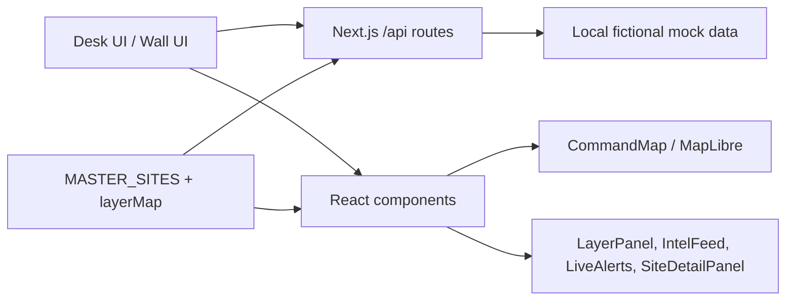
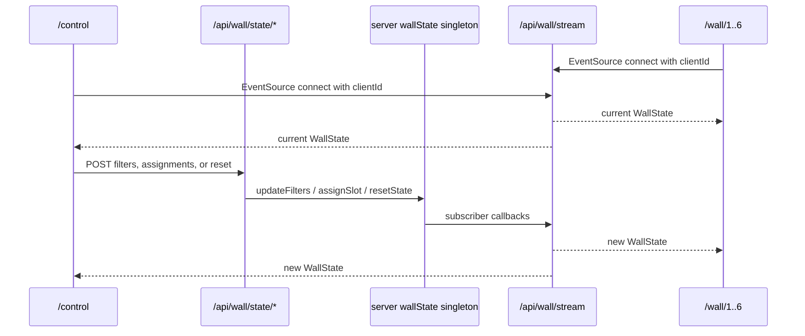

# Sentinel Command Center Architecture

This document was regenerated from the current codebase. It describes what is present in the repository now, including known inconsistencies and cleanup items.

## Overview

Sentinel Command Center is a fictional security command center demo. It presents global site posture, twelve security-domain layers, per-site detail, live activity, and a synchronized six-screen video wall.

What it is:
- A Next.js security program situational-awareness dashboard.
- A MapLibre-based map UI for fictional sites and fictional security-domain data.
- A video-wall system with six `/wall/[slot]` display routes and one `/control` operator surface.
- Demo-only data: all company, site, program, alert, and asset names are disguised placeholders.

What it is not:
- Not a SIEM, sensor, detector, production data connector, or incident-response backend.
- Not connected to real security systems in demo mode.
- Not horizontally safe for wall sync without an external shared store; wall state is in memory.

## Tech Stack

Verified from [package.json](package.json):

| Area | Package/version |
|---|---|
| Framework | `next` `16.2.6`, App Router |
| UI runtime | `react` `19.2.4`, `react-dom` `19.2.4` |
| Language | `typescript` `^5` |
| Map | `maplibre-gl` `^5.24.0` |
| Motion | `framer-motion` `^12.38.0` |
| Charts | `recharts` `^3.8.1` |
| Icons | `lucide-react` `^1.17.0` |
| UI primitives | `radix-ui` `^1.4.3`, `shadcn` `^4.8.2` generated components |
| Styling | Tailwind CSS v4 via `tailwindcss` `^4`, `@tailwindcss/postcss` `^4`, CSS variables in [src/app/globals.css](src/app/globals.css) |
| Build/runtime | Next standalone output in [next.config.ts](next.config.ts), Node 22 Alpine Docker image |

Important config:
- [next.config.ts](next.config.ts) sets `output: 'standalone'`, transpiles `maplibre-gl`, allows broad remote images, and currently ignores TypeScript build errors.
- [Dockerfile](Dockerfile) builds with `npm install`, `npm run build`, then runs `.next/standalone/server.js`.
- [docker-compose.yml](docker-compose.yml) exposes port `3000`.
- [vercel.json](vercel.json) gives API functions a `30s` max duration.
- No `render.yaml` and no wall launch scripts are currently present.

## High-Level Architecture

The core data seam is local HTTP. The desk dashboard fetches security-domain data from Next.js `/api/*` routes and passes the assembled data object into the map and HUD components.



Data route principle:
- Domain data should enter the client through `/api/*` routes.
- The route response shapes are the seam to keep stable when replacing mocks with real backend adapters.
- [src/data/layerMap.ts](src/data/layerMap.ts) is the name/key/display mapping source of truth.
- Enterprise totals are computed from arrays and site/domain data, not stored as a separate enterprise record.

Verified external runtime calls/exceptions:
- [src/app/page.tsx](src/app/page.tsx) performs client-side Nominatim reverse geocoding on mouse movement.
- [src/components/SearchBar.tsx](src/components/SearchBar.tsx) performs client-side Nominatim search.
- [src/app/page.tsx](src/app/page.tsx) can use ArcGIS World Imagery tiles for satellite map style.
- [src/app/layout.tsx](src/app/layout.tsx) and [src/app/globals.css](src/app/globals.css) reference Google Fonts.
- API domain routes themselves are mock/local. [src/app/api/region-dossier/route.ts](src/app/api/region-dossier/route.ts) is a placeholder and does not call out.

## Data Model

### SiteRecord

The canonical per-site model is in [src/data/sites.ts](src/data/sites.ts).

```ts
export type StatusLevel = 'HEALTHY' | 'WATCH' | 'CRITICAL';
export type SevLevel = 'LOW' | 'MEDIUM' | 'HIGH' | 'CRITICAL';

export interface DomainData {
  score: number;
  trend: number;
  status: StatusLevel;
}

export interface SiteRecord {
  id: string;
  name: string;
  lat: number;
  lng: number;
  region: string;
  businessUnit: string;
  postureScore: number;
  domains: {
    exposure: DomainData & { findings: number; criticals: number; severity: SevLevel };
    app_assurance: DomainData & { findings: number; openTests: number };
    arch_reviews: DomainData & { completed: number; scheduled: number; type: string };
    dlp: DomainData & { policies: number; incidents: number };
    ot_assets: DomainData & { plcs: number; hmis: number; scada: number };
    it_assets: DomainData & { servers: number; endpoints: number; network: number; cloud: number };
    awareness: DomainData & { completion_pct: number; trained: number; total: number };
    sim_campaigns: DomainData & { click_rate: number; sent: number; clicked: number };
    access_recert: DomainData & { overdue: number; total_users: number };
    app_governance: DomainData & { compliant: number; review_due: number; non_compliant: number };
    activity_retention: DomainData & { coverage_pct: number; days_retained: number };
    posture_index: DomainData;
  };
  recentActivity: Array<{
    time: string;
    type: string;
    title: string;
    severity: SevLevel;
  }>;
}
```

Verified data facts:
- [src/data/sites.ts](src/data/sites.ts) exports `MASTER_SITES`, currently 28 fictional sites.
- `SITE_BY_ID` is a `Map` derived from `MASTER_SITES`.
- `DEMO_ACTIVITY_BASE_TIME` fixes recent-activity timestamps to deterministic demo time.
- `postureScore` mirrors the conceptual composite represented by `domains.posture_index`.

Enterprise totals:
- Desk KPI totals are computed in [src/app/page.tsx](src/app/page.tsx) from route arrays or from `selectedSite.domains.*`.
- Wall totals are computed in [src/components/wall/WallViews.tsx](src/components/wall/WallViews.tsx) with helpers like `sumSites`, `avg`, `getStatusCounts`, and `getOpenCriticals`.
- There is no canonical persisted enterprise-total object.

## Layer Map and the 12 Security Domains

[src/data/layerMap.ts](src/data/layerMap.ts) defines `LAYER_GROUPS`, `LAYER_MAP`, `ALL_LAYERS`, and `DEFAULT_ACTIVE_LAYERS`. It is the source of truth for layer keys, labels, descriptions, colors, icons, counted data keys, API endpoint mapping, and panel group.

The display set contains eleven security domains plus one display layer:

| Key | Label | Group | Data keys | Endpoint in code |
|---|---|---|---|---|
| `exposure` | Exposure Findings | Vulnerability | `exposure_sites` | `/api/flights` |
| `app_assurance` | App Assurance | Vulnerability | `assurance_events` | `/api/cyber-threats` |
| `arch_reviews` | Architecture Reviews | Vulnerability | `arch_sites` | `/api/earthquakes` |
| `dlp` | Data Loss Prevention | Data & Assets | `dlp_sites`, `dlp_events`, `dlp_chokepoints` | `/api/maritime` |
| `ot_assets` | OT Asset Registry | Data & Assets | `ot_assets` | `/api/fires` |
| `it_assets` | IT Asset Registry | Data & Assets | `it_assets` | `/api/cctv` |
| `awareness` | Awareness Reach | People & Access | `news` | `/api/news` |
| `sim_campaigns` | Simulated Campaigns | People & Access | `campaign_events` | `/api/weather` |
| `access_recert` | Access Recertification | People & Access | `access_events` | `/api/gdelt` |
| `app_governance` | App Governance | Governance | `governance_apps` | `/api/satellites` |
| `activity_retention` | Activity Retention | Governance | `retention_sites` | `/api/live-news` |
| `day_night` | Day / Night Cycle | Display | none | computed client-side |

Cleanup flag: many endpoint filenames are legacy names from the original fork and no longer match the Sentinel security domain labels. The route bodies are security mocks, but the route paths remain legacy residue and should be renamed behind compatibility aliases in a future cleanup.

## Single-Screen Desk Mode

Entry point: [src/app/page.tsx](src/app/page.tsx).

Primary components:
- [src/components/CommandMap.tsx](src/components/CommandMap.tsx): dynamic MapLibre map, site markers, domain GeoJSON sources/layers, map style/projection changes, site click handling.
- [src/components/LayerPanel.tsx](src/components/LayerPanel.tsx): domain toggles and counts from `ALL_LAYERS`.
- [src/components/IntelFeed.tsx](src/components/IntelFeed.tsx): activity feed sourced from `data.news`.
- [src/components/LiveAlerts.tsx](src/components/LiveAlerts.tsx): alert rows derived from `data.news`.
- [src/components/SiteDetailPanel.tsx](src/components/SiteDetailPanel.tsx): selected-site summary, posture block, critical attention, full domain breakdown, asset detail, recent activity, live alerts.
- [src/components/GlobalStatusBar.tsx](src/components/GlobalStatusBar.tsx): global status, posture, and site counts.
- [src/components/SearchBar.tsx](src/components/SearchBar.tsx): Nominatim search UI.
- [src/components/ViewPresets.tsx](src/components/ViewPresets.tsx), [src/components/SharePanel.tsx](src/components/SharePanel.tsx), [src/components/ScaleBar.tsx](src/components/ScaleBar.tsx), [src/components/KeyboardShortcuts.tsx](src/components/KeyboardShortcuts.tsx): desk controls.

Desk data flow:
1. `page.tsx` initializes all domain layers as inactive.
2. It fetches `/api/news` and `/api/country-risk` immediately.
3. It fetches the rest of the domain routes after a short timeout.
4. Responses are merged into `dataRef.current`.
5. `CommandMap`, panels, alerts, and detail views read from that merged data object.
6. Selecting a site sets `selectedSiteId`, flies the map to the site, and renders `SiteDetailPanel`.

Known desk exceptions:
- `SearchBar` and hover reverse-geocoding call Nominatim directly from the browser.
- Satellite style uses ArcGIS tile URL directly.
- These are existing exceptions, not new backend data sources.

## Video-Wall Mode

The wall system is implemented in:
- [src/server/wallState.ts](src/server/wallState.ts)
- [src/lib/useWallState.tsx](src/lib/useWallState.tsx)
- [src/app/api/wall/stream/route.ts](src/app/api/wall/stream/route.ts)
- [src/app/api/wall/state/filters/route.ts](src/app/api/wall/state/filters/route.ts)
- [src/app/api/wall/state/assignments/route.ts](src/app/api/wall/state/assignments/route.ts)
- [src/app/api/wall/state/reset/route.ts](src/app/api/wall/state/reset/route.ts)
- [src/app/wall/[slot]/page.tsx](src/app/wall/[slot]/page.tsx)
- [src/app/control/page.tsx](src/app/control/page.tsx)
- [src/components/wall/*](src/components/wall)

Deployment model in code:
- One Next.js server process runs locally or in one single-instance production process.
- Six browser windows open `/wall/1` through `/wall/6`.
- One operator window opens `/control`.
- State is in memory in the Node process. It survives module reload through `globalThis.__sentinelWallStore`, but it does not survive process restart and is not shared across multiple instances.

### Wall State Shape

Verified from [src/server/wallState.ts](src/server/wallState.ts):

```ts
export type ViewId =
  | 'map'
  | 'alerts'
  | 'ot-deep-dive'
  | 'it-deep-dive'
  | 'posture-trend'
  | 'activity-feed'
  | 'kpi-grid'
  | 'awareness-board'
  | 'blank';

export type WallSlot = '1' | '2' | '3' | '4' | '5' | '6';
export type TimeRange = '1h' | '24h' | '7d' | '30d';

export type WallFilters = {
  selectedSiteId: string | null;
  timeRange: TimeRange;
  activeDomains: string[];
};

export type WallState = {
  screenAssignments: Record<WallSlot, ViewId>;
  filters: WallFilters;
  lastUpdated: string;
  updatedBy: string;
  version: number;
};
```

Default assignments:

| Slot | Default view |
|---|---|
| `1` | `map` |
| `2` | `alerts` |
| `3` | `ot-deep-dive` |
| `4` | `it-deep-dive` |
| `5` | `posture-trend` |
| `6` | `activity-feed` |

Default filters:
- `selectedSiteId: null`
- `timeRange: '24h'`
- `activeDomains: ALL_LAYERS.map(layer => layer.key)`

Server state functions:
- `getState()`
- `updateFilters(partial, clientId)`
- `assignSlot(slot, view, clientId)`
- `resetState(clientId)`
- `subscribe(cb)`
- `unsubscribe(cb)`
- validators: `isWallSlot`, `isViewId`, `isTimeRange`, `isDomainKey`

Every mutation increments `version` and stamps `lastUpdated` and `updatedBy`.

### Wall Sync Flow



SSE details:
- `GET /api/wall/stream?clientId=...`
- Response type: `text/event-stream; charset=utf-8`
- Sends a comment `: connected <clientId>` on connect.
- Immediately sends full current state.
- Sends keep-alive comments every 20 seconds.
- Cleans up subscriber and interval on request abort.

Mutation endpoints:
- `POST /api/wall/state/filters` with `{ filters: Partial<WallFilters>, clientId }`.
- `POST /api/wall/state/assignments` with `{ slot, view, clientId }`.
- `POST /api/wall/state/reset` with `{ clientId }` optional; defaults to `system`.

Client hook:
- [src/lib/useWallState.tsx](src/lib/useWallState.tsx) creates `WallStateProvider`.
- It stores a unique window `clientId` in `sessionStorage` as `sentinel-wall-client-id`.
- It opens `EventSource('/api/wall/stream?clientId=...')`.
- It exposes `state`, `connectionStatus`, `lastRemoteVersion`, `updateFilters`, `assignSlot`, `resetWall`, and `isOwnEcho`.
- Echo handling accepts the server response but lets consumers suppress transitions when `updatedBy` matches the current client and version.

### Wall Slots

[src/app/wall/[slot]/page.tsx](src/app/wall/[slot]/page.tsx):
- Awaits the dynamic route param.
- Validates it with `isWallSlot`.
- Renders [src/components/wall/WallSlotSurface.tsx](src/components/wall/WallSlotSurface.tsx).

[src/components/wall/WallSlotSurface.tsx](src/components/wall/WallSlotSurface.tsx):
- Wraps each slot in `WallStateProvider`.
- Reads `screenAssignments[slot]` and `filters`.
- Renders [src/components/wall/ViewRenderer.tsx](src/components/wall/ViewRenderer.tsx).
- Reserves a footer row for connection status, slot number, and `DEMO DATA`.
- Hides Next.js dev overlay elements in wall slots.

### Control Surface and Stage-Then-Push Model

[src/app/control/page.tsx](src/app/control/page.tsx) renders [src/components/wall/ControlSurface.tsx](src/components/wall/ControlSurface.tsx).

The control surface has two selection/filter states:
- Live wall state: `state.filters` from SSE. This is what `/wall/1..6` render.
- Draft state: local `draftFilters` React state in `ControlSurfaceInner`. This is private to `/control`.

Verified behavior:
- The "On Wall" card shows the live selected site/time/domain count.
- The "Exploring Draft" card shows the private draft selected site and whether it is in sync.
- The settings button scrolls to the draft filter card.
- The "Explore Privately" view renders `ViewRenderer` with `mode="control"`.
- In control mode, `MapWallView` passes marker clicks to `onDraftSiteSelect`, which updates draft `selectedSiteId` only.
- "Push to wall" calls `updateFilters(filters)`, promoting draft filters to live wall state.
- "Sync from wall" copies `liveFilters` back into `draftFilters`.
- Slot dropdowns call `assignSlot` immediately; they are live layout controls.
- Layout presets call `assignSlot` for all six slots immediately and stage preset filters as draft.
- Reset calls `resetWall()` and resets local draft filters to Normal Ops.

## The Eight Wall Views

Wall view routing is in [src/components/wall/ViewRenderer.tsx](src/components/wall/ViewRenderer.tsx), and implementations are in [src/components/wall/WallViews.tsx](src/components/wall/WallViews.tsx).

`WALL_VIEW_META` labels:
- `map` → Map View
- `alerts` → Alerts Board
- `ot-deep-dive` → OT Deep Dive
- `it-deep-dive` → IT Deep Dive
- `posture-trend` → Posture Trend
- `activity-feed` → Activity Feed
- `kpi-grid` → KPI Grid
- `awareness-board` → Awareness Board
- `blank` → Blank

Implemented view components:
- `MapWallView`: uses `CommandMap`, global map counts, risk-ranked site list, activity list, and `SiteDetailPanel` when `filters.selectedSiteId` is set. In `mode="display"`, map interaction is disabled; in `mode="control"`, site marker clicks update draft selection.
- `AlertsBoard`: alert queue generated from scoped site data with severity mix and domain load panels.
- `OTDeepDive`: OT asset total, posture/watch cards, asset mix donut, exposure watchlist, recent OT signals.
- `ITDeepDive`: IT asset total, posture/cloud cards, endpoint concentration list, estate mix donut.
- `PostureTrend`: posture hero stats and Recharts line chart by domain family.
- `ActivityFeed`: rolling feed generated from scoped `recentActivity` plus synthetic alert rows.
- `KpiGrid`: 3/4-column responsive grid of all layer/domain score cards.
- `AwarenessBoard`: awareness completion, campaign sends/click rate, business-unit chart, campaign watchlist.
- `BlankWallView`: intentional idle screen with Sentinel mark and current time.

All non-map views scope through `getScopedSites(filters)`: selected site when `filters.selectedSiteId` exists, otherwise `MASTER_SITES`.

## API Routes

### Security Data Routes

All routes below are local demo mocks unless noted. They simulate latency and return fictional data with cache headers.

| Route | Current purpose | Key response shape | External dependency |
|---|---|---|---|
| `/api/sites` | Full per-site registry | `{ sites: SiteRecord[], total, timestamp }`; supports `?id=` filter | None |
| `/api/country-risk` | Global posture/domain scores and backward-compatible status fields | `{ posture_score, domains, exchanges, countries, open_exchanges, timestamp }` | None |
| `/api/flights` | Exposure Findings data despite legacy path name | `{ exposure_sites, total, timestamp }` | None |
| `/api/cyber-threats` | App Assurance events | `{ assurance_events, stats, total, timestamp }` | None |
| `/api/earthquakes` | Architecture Review sites despite legacy path name | `{ arch_sites, total, timestamp }` | None |
| `/api/maritime` | DLP sites/incidents/chokepoints despite legacy path name | `{ dlp_sites, dlp_events, dlp_chokepoints, total_sites, total_incidents, timestamp }` | None |
| `/api/fires` | OT Asset Registry dots despite legacy path name | `{ ot_assets, total, timestamp }`; `dynamic = 'force-dynamic'` | None |
| `/api/cctv` | IT Asset Registry dots despite legacy path name | `{ it_assets, total, timestamp }` | None |
| `/api/news` | Awareness/activity feed despite generic path name | `{ news, total, timestamp }` | None |
| `/api/weather` | Simulated Campaign events despite legacy path name | `{ campaign_events, total, timestamp }` | None |
| `/api/gdelt` | Access Recertification events despite legacy path name | `{ access_events, total, timestamp }`; `dynamic = 'force-dynamic'` | None |
| `/api/satellites` | App Governance apps despite legacy path name | `{ governance_apps, total, timestamp }` | None |
| `/api/live-news` | Activity Retention sites despite generic path name | `{ retention_sites, total, timestamp }` | None |
| `/api/region-dossier` | Placeholder right-click dossier | `{ location, country, summary, risk_level, timestamp }` | None in current code |
| `/api/health` | API/platform health summary | `{ status, platform, endpoints, timestamp }` | None |

### Wall Sync Routes

| Route | Method | Purpose | Shape |
|---|---|---|---|
| `/api/wall/stream` | GET | SSE stream of full `WallState` | event-stream comments plus `data: <WallState>` |
| `/api/wall/state/filters` | POST | Update live `filters` | body `{ filters, clientId }`, returns `WallState` |
| `/api/wall/state/assignments` | POST | Update one `screenAssignments[slot]` | body `{ slot, view, clientId }`, returns `WallState` |
| `/api/wall/state/reset` | POST | Restore defaults | body `{ clientId? }`, returns `WallState` |

## Key Files Map

| Path | Role |
|---|---|
| [src/app/layout.tsx](src/app/layout.tsx) | Root metadata, JSON-LD, tooltip provider, app error boundary |
| [src/app/page.tsx](src/app/page.tsx) | Single-screen desk dashboard state, route fetching, map/HUD composition |
| [src/app/globals.css](src/app/globals.css) | Global tokens, glass styling, responsive/mobile styles |
| [src/components/CommandMap.tsx](src/components/CommandMap.tsx) | MapLibre initialization, sources/layers, marker selection, fly-to behavior |
| [src/components/SiteDetailPanel.tsx](src/components/SiteDetailPanel.tsx) | Shared per-site detail summary used by desk and wall map |
| [src/components/LayerPanel.tsx](src/components/LayerPanel.tsx) | Security-domain controls based on `ALL_LAYERS` |
| [src/components/IntelFeed.tsx](src/components/IntelFeed.tsx) | Activity feed using `data.news` |
| [src/components/LiveAlerts.tsx](src/components/LiveAlerts.tsx) | Alert list derived from activity feed items |
| [src/components/ui/*](src/components/ui) | shadcn/Radix primitives and `GlassPanel` |
| [src/components/wall/ControlSurface.tsx](src/components/wall/ControlSurface.tsx) | Operator surface, draft/live filters, slot layout controls |
| [src/components/wall/ViewRenderer.tsx](src/components/wall/ViewRenderer.tsx) | View-id-to-component mapping, preview/control/display modes |
| [src/components/wall/WallSlotSurface.tsx](src/components/wall/WallSlotSurface.tsx) | Six-slot wall shell and connection footer |
| [src/components/wall/WallViews.tsx](src/components/wall/WallViews.tsx) | All wall view implementations |
| [src/components/wall/WallStateJson.tsx](src/components/wall/WallStateJson.tsx) | `/wall/test` live state debug page |
| [src/data/sites.ts](src/data/sites.ts) | `SiteRecord`, `MASTER_SITES`, `SITE_BY_ID` |
| [src/data/layerMap.ts](src/data/layerMap.ts) | Layer/domain single source of truth |
| [src/server/wallState.ts](src/server/wallState.ts) | In-memory wall state singleton and mutation helpers |
| [src/lib/useWallState.tsx](src/lib/useWallState.tsx) | SSE client hook/context and wall mutators |
| [src/lib/ssrf-guard.ts](src/lib/ssrf-guard.ts) | SSRF validation, `safeFetch`, and in-memory rate limiting helpers |
| [src/proxy.ts](src/proxy.ts) | API route rate-limit proxy middleware |
| [Dockerfile](Dockerfile), [docker-compose.yml](docker-compose.yml) | Container production deployment |
| [vercel.json](vercel.json) | Vercel API duration config |

## Deployment

### Local Development

```sh
npm install
npm run dev
```

Default dev route set:
- Desk: `http://localhost:3000/`
- Control: `http://localhost:3000/control`
- Wall slots: `http://localhost:3000/wall/1` through `/wall/6`
- Wall state debug: `http://localhost:3000/wall/test`

### Local PC Video Wall

The implemented wall model assumes:
- One local Next.js server.
- Six fullscreen/kiosk browser windows pointed at `/wall/1` to `/wall/6`.
- One operator browser window pointed at `/control`.
- All seven windows connect to the same server process via SSE.

There are no checked-in `wall-launch.bat` or `wall-stop.bat` scripts. If added later, they should start the single Next server, open six Chrome kiosk windows plus one control window, and preserve the single-instance assumption.

### Container / Web Service

Docker:
- Build uses Node 22 Alpine.
- Runtime serves standalone Next output with `node server.js`.
- `PORT=3000`, `HOSTNAME=0.0.0.0`.

Render:
- No `render.yaml` exists.
- A Render web service should run a single instance using either the Dockerfile or equivalent `npm install`, `npm run build`, `npm run start`.
- Do not scale horizontally unless wall state is moved from process memory into a shared store.

Vercel:
- `vercel.json` exists, but the in-memory wall state is not suitable for multi-instance/serverless scaling.

## Constraints and Invariants

- Keep data disguised. No real company, facility, internal program, or live customer data belongs in the repo.
- Preserve `SiteRecord` shape unless every consumer is updated together.
- Preserve route response shapes when replacing mock bodies with real adapters.
- Keep client domain data behind `/api/*` routes. Existing direct external browser calls are map/geocode/font exceptions and should not expand without review.
- Keep [src/data/layerMap.ts](src/data/layerMap.ts) as the single source for layer labels, keys, colors, groups, counted data keys, and endpoint mapping.
- Enterprise totals are computed from arrays/site-domain fields; do not introduce a hardcoded enterprise-total source.
- Keep [src/lib/ssrf-guard.ts](src/lib/ssrf-guard.ts) intact. Any future user-controlled outbound proxy route should use `validateHost` or `safeFetch`.
- Wall sync state is in memory and assumes a single Node process.
- Wall slot pages are display surfaces; operator interactions belong in `/control`.

## Verified Residue and Cleanup Flags

Mandatory residue search was run against the repository excluding generated dependency/build folders.

Runtime/source findings:
- Legacy route filenames still exist and are wired in `layerMap.ts`, `page.tsx`, and `/api/health`: `/api/flights`, `/api/earthquakes`, `/api/maritime`, `/api/fires`, `/api/cctv`, `/api/weather`, `/api/gdelt`, `/api/satellites`, `/api/news`, `/api/live-news`. Their payloads are Sentinel security-domain mocks, but the paths are legacy naming residue.
- [src/components/CommandMap.tsx](src/components/CommandMap.tsx) has comments with old analogy wording, including "like maritime ports" and "news items with coords". The rendered product remains security-focused; comments should be cleaned later.
- [src/app/page.tsx](src/app/page.tsx) uses a `Satellite` icon and a "SATELLITE" map-style control for ArcGIS imagery. This is a map basemap option, not a satellite intelligence layer.
- [src/app/globals.css](src/app/globals.css) contains comments with "intelligence aesthetic" / "intelligence operations" wording. These are styling comments and should be renamed to security-command-center language.
- [HANDOFF.md](HANDOFF.md) still contains stale references including `OsirisMap`, old unused route names, and OSINT cleanup notes. Treat it as a historical handoff file, not current architecture.

No current runtime source files contain `OSIRIS`, `OSINT`, or `RECON` identifiers after excluding `HANDOFF.md` and this architecture document. No `/api/osint/*`, `/api/scanner`, `/api/markets`, `/api/frontlines`, `/api/space-weather`, or `/api/infrastructure` files exist in the current tree.
